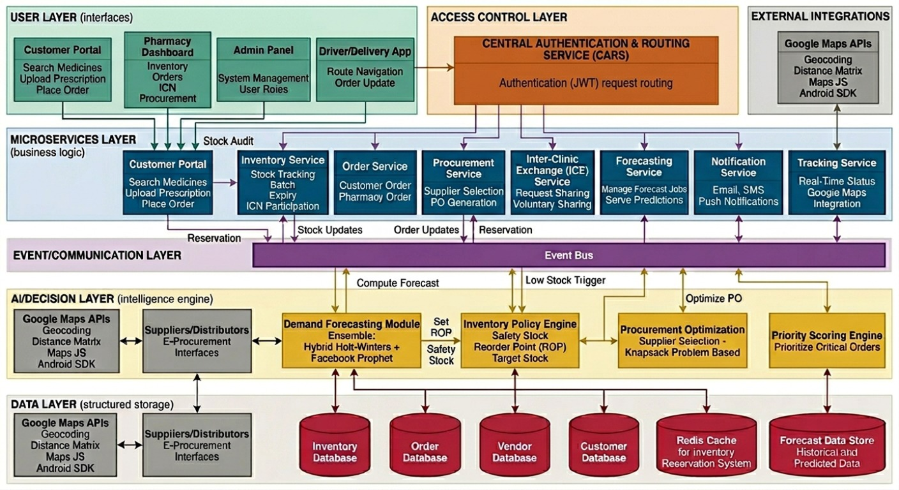
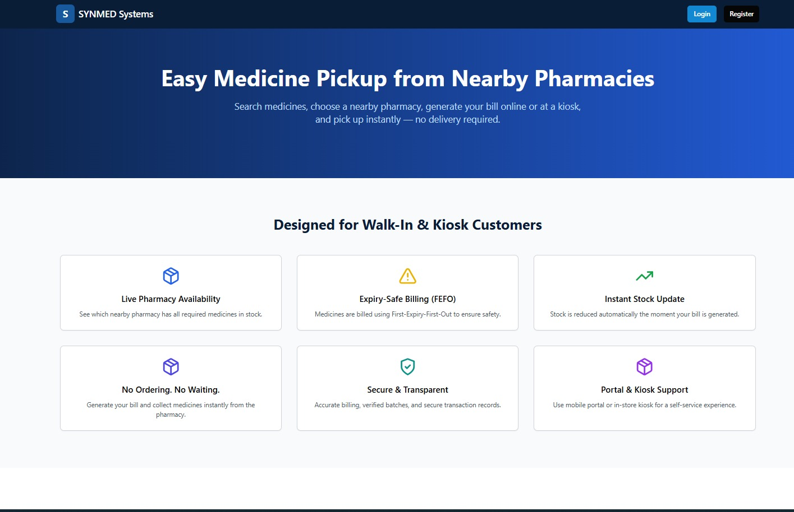
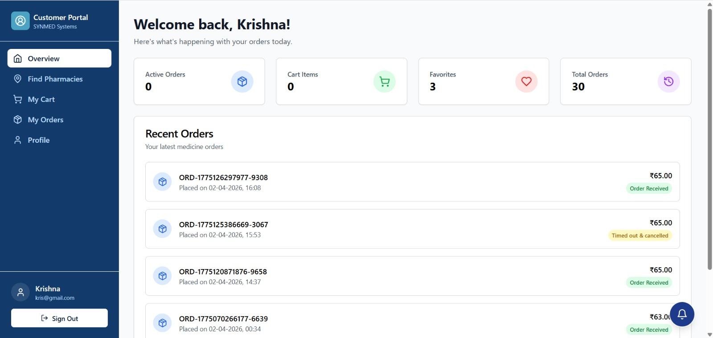
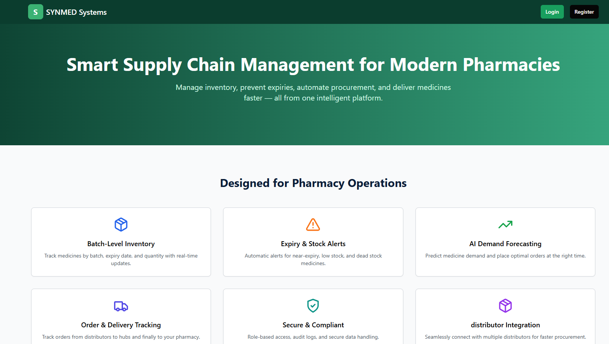
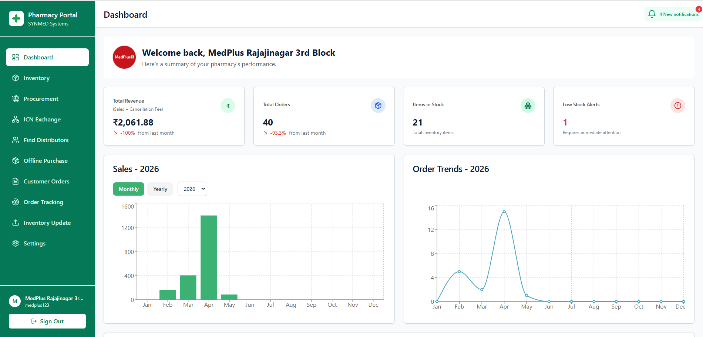
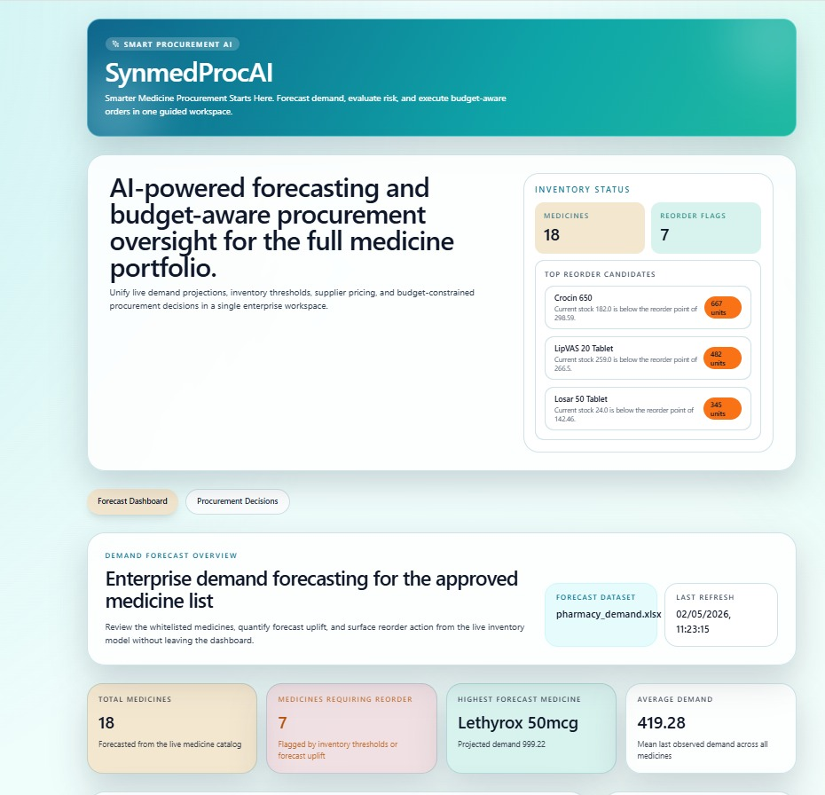
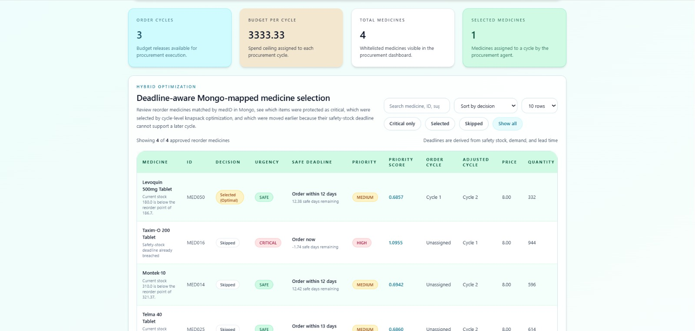
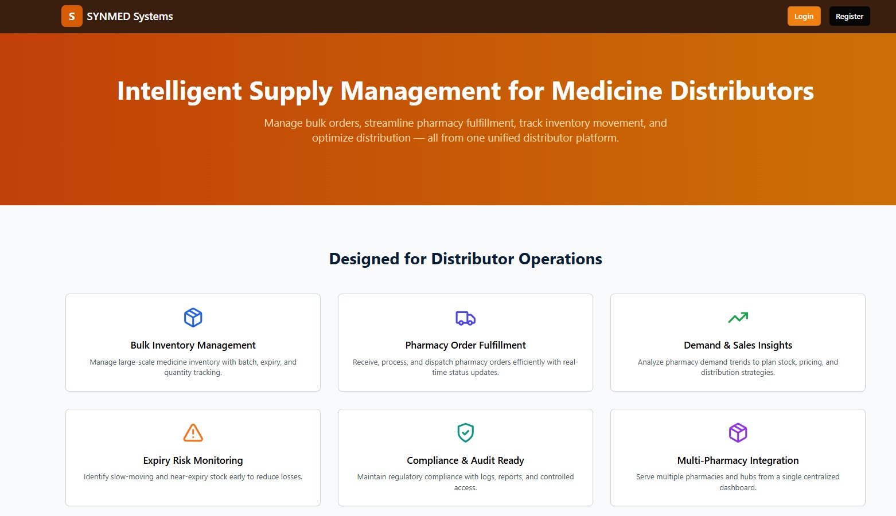
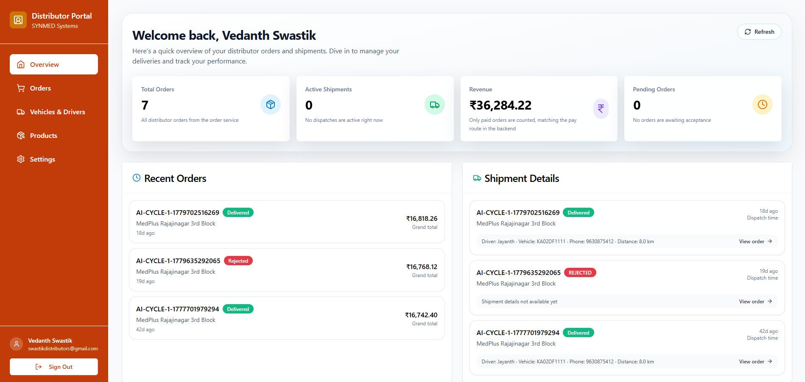
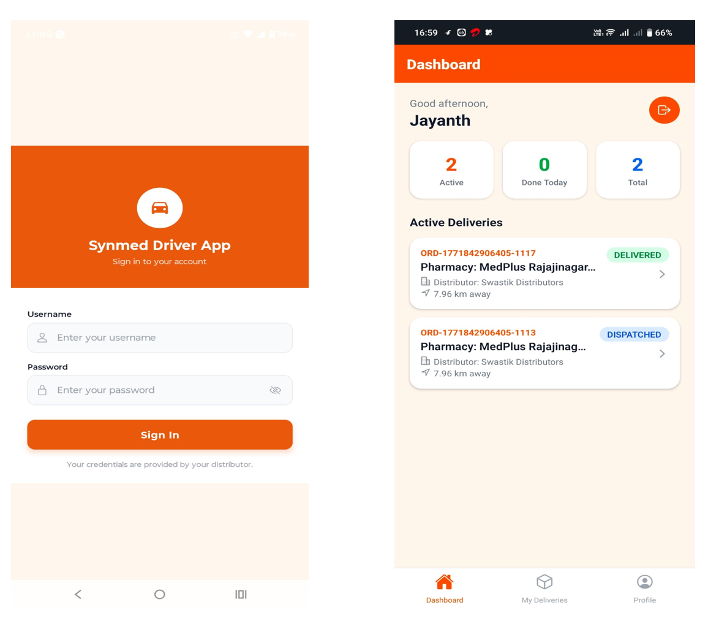

# SYNMED Systems - Medical Supply Chain Management System

SYNMED Systems is a multi-role medical supply chain platform built to digitize the flow of medicines between customers, pharmacies, distributors, administrators, and delivery drivers. The system combines web portals, backend microservices, a driver mobile app, order tracking, and an AI-assisted procurement engine to demonstrate how modern healthcare supply operations can become more visible, predictable, and responsive.

The project is designed as a final-year scale prototype with a strong real-world orientation: customers can search and order medicines, pharmacies can manage stock and sales, distributors can process supply operations, administrators can supervise the ecosystem, drivers can manage deliveries, and AI modules can support forecasting and replenishment decisions.

## Overview

- [What The System Delivers](#what-the-system-delivers)
- [Core Modules](#core-modules)
- [AI Demand Forecasting And Procurement Intelligence](#ai-demand-forecasting-and-procurement-intelligence)
- [Driver And Delivery Workflow](#driver-and-delivery-workflow)
- [System Architecture](#system-architecture)
- [Microservices Architecture](#microservices-architecture)
- [User Roles](#user-roles)
- [Technologies Used](#technologies-used)
- [Important Workflows](#important-workflows)
- [Getting Started](#getting-started)
- [Application Build](#application-build)
- [Application Screenshots](#application-screenshots)
- [Current Implementation Status](#current-implementation-status)
- [Future Enhancements](#future-enhancements)
- [Project Vision](#project-vision)

## What The System Delivers

- Customer medicine discovery, cart, checkout, billing, and order tracking
- Pharmacy inventory management, online order handling, offline walk-in sales, procurement, ICN-style exchange workflows, and live delivery visibility
- Distributor product, invoice, shipment, vehicle, and driver management interfaces
- Admin dashboards for user registration, pharmacy oversight, vendors, vehicles, and operational monitoring
- Dedicated React Native driver app for delivery assignment, status updates, profile management, and mobile logistics workflows
- AI demand forecasting and procurement decision support using FastAPI services
- Budget-aware AI procurement planning with priority scoring, stockout urgency, distributor evaluation, and multi-cycle order allocation
- MongoDB-backed services for users, inventory, orders, and distributor data
- Redis-backed reservation patterns for stock availability and order processing
- Standalone tracking UI for delivery and order status visualization

## Core Modules

| Area | Implementation |
| --- | --- |
| Customer Portal | React + TypeScript portal for medicine search, cart, checkout, profile, pharmacies near the user, and order tracking |
| Pharmacy Portal | React + TypeScript dashboard for inventory, orders, procurement, offline sales, ICN, distributor search, and live driver map views |
| Distributor Portal | React + TypeScript portal for distributor products, orders, invoices, shipments, vehicles, and drivers |
| Admin Portal | React + TypeScript portal for platform overview, pharmacy management, vendors, vehicles, settings, and registration |
| Driver App | Expo React Native mobile app with driver login, active deliveries, detail screens, status transitions, and profile |
| Backend Services | Node.js, Express, TypeScript services for users, inventory, orders, distributor operations, and a GraphQL gateway scaffold |
| AI Engine | FastAPI services for forecasting, inventory intelligence, procurement recommendations, and order/procurement traces |
| Tracking App | Standalone Vite tracking experience for order and delivery timeline visualization |
| Infrastructure | Docker Compose setup for MongoDB, Redis, RabbitMQ, gateway, services, and web portals |

## AI Demand Forecasting And Procurement Intelligence

The AI engine lives primarily under:

```text
ai-engine-medical-supply-engine - Copy/
```

It exposes a FastAPI backend with forecast, inventory, procurement, and order routes:

```text
GET  /forecast
GET  /inventory
GET  /procurement
GET  /procurement/data
POST /procurement/config
GET  /procurement/trace/{medicine_id}
```

The procurement layer is one of the most advanced parts of the repository. It models medicine replenishment as an operational decision problem, not just a low-stock alert. It evaluates:

- current stock and safety stock
- forecast quantity and average demand
- reorder point and order quantity
- days to stockout and safe ordering deadline
- distributor availability, price, lead time, and rating
- medicine priority using shortage, demand, and lead-time weights
- monthly pharmacy budget split across configurable order cycles
- critical items first, then budget-optimized selection using a knapsack-style allocation pass

This creates an AI-assisted purchasing workflow where the system can recommend what to order, when to order it, how urgent it is, which distributor should fulfill it, and how the recommendation fits into the pharmacy's monthly procurement budget.

## Driver And Delivery Workflow

The repository includes a dedicated delivery subsystem in:

```text
driver-app/
```

The mobile app is built with Expo and React Native. It supports:

- secure driver login
- home dashboard with active and completed deliveries
- delivery list with active, completed, and all tabs
- delivery detail pages with customer, pharmacy, vehicle, and status information
- status progression from assigned to picked up, in transit, delivered, or failed
- profile and password management
- mobile-friendly API integration for physical-device testing over LAN

The driver backend exposes endpoints for authentication, driver profile retrieval, delivery listing, delivery details, and delivery status updates.

## System Architecture

The structure below shows how the repository is organized into role-specific frontend portals, backend microservices, AI services, the driver mobile application, tracking modules, and supporting infrastructure.

```text
MSCMS/
|-- frontend/
|   |-- customer-portal/
|   |-- pharmacy-portal/
|   |-- distributor-portal/
|   |-- admin-portal/
|   `-- shared/
|-- backend/
|   |-- api-gateway/
|   |-- services/
|   |   |-- user-service/
|   |   |-- inventory-service/
|   |   |-- order-service/
|   |   |-- distributor-service/
|   |   `-- distributor_order-service/
|   `-- database/init/
|-- ai-services/
|   |-- demand-forecasting/
|   |-- invoice-processing/
|   `-- analytics-engine/
|-- ai-engine-medical-supply-engine - Copy/
|   |-- backend/
|   `-- frontend/
|-- driver-app/
|   |-- src/
|   `-- backend/
|-- tracking/
|-- infrastructure/
`-- scripts/
```

## Microservices Architecture

SYNMED Systems follows a modular microservices-style architecture where each major business capability is separated into its own service or application. This keeps the system easier to maintain, easier to scale, and easier to extend as new healthcare supply-chain workflows are added.

The backend is organized around domain-specific services:

| Service | Responsibility |
| --- | --- |
| API Gateway | Central GraphQL/API entry scaffold for routing platform requests and exposing unified contracts |
| User Service | Authentication, role-based login, user profiles, pharmacy registration, distributor registration, and admin access |
| Inventory Service | Pharmacy medicine inventory, stock levels, availability, prescription upload support, and stock statistics |
| Order Service | Customer-to-pharmacy orders, pharmacy order status transitions, stock reservation logic, and offline pharmacy sales |
| Distributor Service | Distributor-side catalog, invoice, and supply operation foundations |
| Distributor Order Service | Distributor order lifecycle support for pharmacy-to-distributor procurement flows |
| AI Engine | Forecasting, inventory intelligence, procurement recommendation, and traceable decision support |
| Driver Backend | Driver authentication, delivery assignment listing, delivery detail retrieval, and delivery status updates |

The frontend layer is also split by role. Customers, pharmacies, distributors, and administrators each have a separate portal, allowing every user group to get a focused workflow instead of a single overloaded interface. The driver experience is separated further into a mobile app because delivery staff need a field-ready interface rather than a desktop dashboard.

MongoDB is used as the primary persistence layer for operational data, Redis supports fast reservation and availability checks, and RabbitMQ is included for asynchronous service communication patterns. Docker Compose ties the platform together for local orchestration, making the project closer to a deployable distributed system than a single monolithic application.

The diagram below gives a high-level overview of the SYNMED Systems microservices architecture, showing how the portals, backend services, AI engine, driver application, databases, cache, and messaging components work together.



## User Roles

### Customers

Customers can register, search medicine availability, compare nearby pharmacy options, manage a cart, place orders, view bills, update profile information, and track order status.

### Pharmacies

Pharmacies can manage inventory, monitor stock activity, process customer orders, handle offline purchases, search distributor inventory, run procurement workflows, view delivery progress, and manage pharmacy-specific settings.

### Distributors

Distributors can manage products, orders, invoices, shipments, vehicles, and drivers. The portal is structured for supply dispatch operations and future integration with automated procurement orders.

### Administrators

Administrators can supervise registrations, pharmacies, vendors, vehicles, order summaries, settings, and overall platform activity through a management dashboard.

### Drivers

Drivers use the mobile app to authenticate, view assigned deliveries, update delivery status, and manage their delivery profile.

## Technologies Used

| Category | Technologies |
| --- | --- |
| Frontend Framework | React, TypeScript, Vite |
| Styling And UI | Tailwind CSS, shadcn-style components, Lucide React icons, responsive dashboard layouts |
| Routing And State | React Router, Context API, custom hooks, local storage utilities |
| Charts And Visualization | Recharts, tracking timelines, dashboard cards, operational status components |
| Mobile Development | Expo, React Native, React Navigation, Expo Secure Store, Async Storage, Expo Location |
| Backend Runtime | Node.js, Express.js, TypeScript |
| API Layer | REST APIs, GraphQL gateway scaffold, service-specific route modules |
| AI And Forecasting | Python, FastAPI, demand forecasting services, procurement decision logic, inventory policy calculations |
| Procurement Optimization | Priority scoring, safety-stock analysis, distributor selection, budget allocation, knapsack-style optimization |
| Database | MongoDB with separate service databases and collections |
| Caching And Reservation | Redis for fast stock reservation and availability patterns |
| Messaging | RabbitMQ for asynchronous messaging architecture support |
| Authentication | JWT-based authentication, role-aware login flows, protected service routes |
| File Uploads | Multer-based upload handling for prescriptions, invoices, and pharmacy assets |
| DevOps And Runtime | Docker, Docker Compose, Nginx configuration, Prometheus monitoring assets |
| Tooling | npm workspaces, TypeScript compiler, ts-node-dev, Vite dev servers, EAS build support for mobile |

## Important Workflows

### Customer Order Flow

1. Customer searches for medicines and pharmacies.
2. Customer adds medicines to cart and checks out.
3. Order service creates customer-to-pharmacy order records.
4. Pharmacy reviews and transitions order status.
5. Stock reservations can be held temporarily while the order is active.
6. Customer tracks progress through the portal or tracking experience.

### Pharmacy Offline Sale Flow

1. Pharmacist searches current inventory.
2. Items are added to an offline purchase cart.
3. Customer, doctor, tax, discount, and bill details are captured.
4. Offline order is saved for pharmacy records.
5. Completion records sale history for later reporting.

### AI Procurement Flow

1. Forecasting layer estimates medicine demand.
2. Inventory policy calculates reorder needs.
3. Procurement logic evaluates priority, urgency, and budget.
4. Distributor candidates are compared by stock, price, lead time, and rating.
5. AI generates selected and skipped recommendations with reasons.
6. Pharmacy can review suggested orders and proceed with procurement actions.

### Driver Delivery Flow

1. Distributor or backend assigns delivery records.
2. Driver logs into the mobile app.
3. Driver views active deliveries and details.
4. Driver updates status through the delivery lifecycle.
5. Delivery state becomes visible to operations-facing views.

## Getting Started

### Prerequisites

- Node.js 18 or later
- npm 9 or later
- Python 3.10 or later
- Docker and Docker Compose
- MongoDB and Redis, either local or via Docker

### App Installation

```bash
npm install -g expo-cli
npm install -g eas-cli
npm install expo@^54.0.0
npx expo install expo-secure-store
```

### Execution Rule

Use `npm run dev` for frontend development servers and `npm start` for backend services and the driver app.

Important: Do not use `npm run build` for backend execution. Backend services should be started with `npm start`.

### Frontend Portals

Open each portal directory and run the frontend development command:

```bash
cd Medical-Supply-Chain-Management/frontend/pharmacy-portal
npm run dev

cd Medical-Supply-Chain-Management/frontend/customer-portal
npm run dev

cd Medical-Supply-Chain-Management/frontend/admin-portal
npm run dev

cd Medical-Supply-Chain-Management/frontend/distributor-portal
npm run dev
```

### Backend Services

Open each backend service directory and start it with `npm start`:

```bash
cd Medical-Supply-Chain-Management/backend/services/user-service
npm start

cd Medical-Supply-Chain-Management/backend/services/inventory-service
npm start

cd Medical-Supply-Chain-Management/backend/services/order-service
npm start

cd Medical-Supply-Chain-Management/backend/services/distributor-service
npm start

cd Medical-Supply-Chain-Management/backend/services/distributor_order-service
npm start
```

### Driver Backend And App

Start the driver backend first:

```bash
cd Medical-Supply-Chain-Management/driver-app/backend
npm start
```

Then start the driver mobile app:

```bash
cd Medical-Supply-Chain-Management/driver-app
npm start
```

For a physical phone, update the API base URL in:

```text
driver-app/src/api/api.ts
```

Use the machine's LAN IP so the Expo app can reach the local backend.

### Redis Monitor

```bash
docker exec -it redis-local redis-cli
monitor
```

### AI Demand Forecasting

```bash
cd "Medical-Supply-Chain-Management/ai-engine-medical-supply-engine - Copy/backend"
uvicorn app.main:app --reload

cd "Medical-Supply-Chain-Management/ai-engine-medical-supply-engine - Copy/frontend"
npm run dev
```

The FastAPI service exposes forecasting and procurement routes from the `app.main` entry point.

### Optional Docker Compose

```bash
docker-compose up -d
```

Docker Compose includes MongoDB, Redis, RabbitMQ, the API gateway, backend services, and web portal containers.

## Application Build

Build the Android driver app preview with EAS:

```bash
eas build -p android --profile preview
```


## Application Screenshots

The screenshots below provide a minimal visual demonstration of the major SYNMED Systems modules. For privacy and security reasons, only selected landing pages and dashboard views are included instead of full operational screens, detailed records, credentials, customer information, or internal datasets.

### 1. Customer Portal

The customer portal is designed for medicine discovery, nearby pharmacy selection, cart management, pickup-based ordering, billing, and order tracking. The landing page introduces the walk-in and kiosk-friendly medicine pickup flow, while the dashboard gives customers a clear summary of active orders, cart items, favorites, and recent order history.





### 2. Pharmacy Portal

The pharmacy portal gives pharmacies a focused operations workspace for inventory monitoring, procurement, customer orders, offline purchases, distributor discovery, order tracking, and stock updates. The landing screen communicates the pharmacy-facing value proposition, while the dashboard highlights revenue, order trends, inventory count, low-stock alerts, and performance charts.





### 3. AI Forecasting And Procurement

The AI module demonstrates demand forecasting and budget-aware procurement intelligence for the pharmacy medicine portfolio. It summarizes forecasted demand, reorder flags, inventory status, and procurement candidates, then shows how medicines are prioritized by urgency, safe deadline, order cycle, quantity, and AI-assisted selection decisions.





### 4. Distributor Portal

The distributor portal supports bulk supply operations, pharmacy order fulfillment, shipment visibility, product management, and vehicle-driver coordination. The landing page presents distributor-side capabilities, while the dashboard summarizes order volume, active shipments, revenue, pending orders, recent orders, and shipment details.





### 5. Driver App

The driver app is a mobile-first delivery interface for drivers assigned by distributors. The login screen provides controlled access for authorized drivers, and the dashboard shows active deliveries, completed delivery count, total assignments, current delivery status, pharmacy destination, distributor name, and approximate delivery distance.




## Current Implementation Status

SYNMED Systems is best understood as a comprehensive, modular academic prototype. Several workflows are implemented with real UI and backend logic, especially authentication, inventory foundations, order handling, offline pharmacy sales, admin views, the driver mobile subsystem, and the AI procurement engine. Some advanced areas, such as full distributor automation, complete ICN backend integration, and production-grade real-time logistics, remain natural extension points.

This balance is intentional for a large final-year project: the repository demonstrates a full healthcare supply-chain ecosystem, while still leaving clear engineering paths for hardening contracts, aligning ports and schemas, strengthening security, and connecting all AI recommendations directly to live operational data.

## Future Enhancements

- Connect forecasting directly to completed order history and pharmacy sales records
- Standardize inventory and order schemas across all services and portals
- Add WebSocket-based live notifications for customers, pharmacies, distributors, and drivers
- Fully integrate AI procurement suggestions with distributor purchase-order creation
- Expand invoice processing with production OCR and validation
- Add route optimization and GPS-based delivery tracking for drivers
- Strengthen authentication, password policies, audit logging, and deployment security
- Add automated integration tests for cross-service workflows

## Project Vision

SYNMED Systems is built around a simple but important idea: medicine supply should not be invisible, reactive, or fragmented. By connecting inventory, demand, procurement, ordering, delivery, and administration in one modular platform, the system shows how pharmacies and distributors can move toward smarter, data-driven healthcare logistics.

The result is not just a set of screens. It is a working blueprint for an intelligent medical supply chain platform that can grow from a strong prototype into a practical healthcare operations product.
