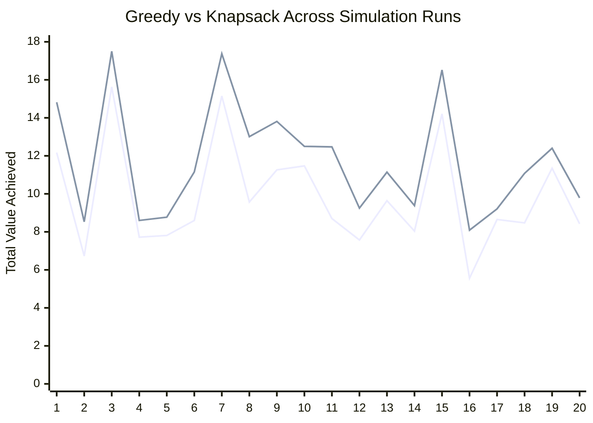
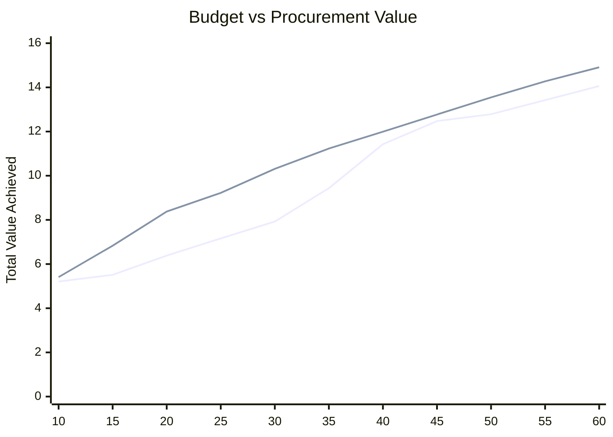

# Greedy vs 0/1 Knapsack for Budget-Constrained Medicine Procurement

## Executive Summary

This report evaluates a system-level upgrade in an AI-driven pharmacy inventory optimization pipeline:

`Forecast -> ROP -> Priority Assignment -> Optimization -> Procurement`

The central question is whether medicine procurement under budget constraints should rely on a simple Greedy heuristic or on a 0/1 Knapsack optimizer.

The conclusion is strong and technically defensible:

- Greedy is fast and simple, but it is only locally rational.
- 0/1 Knapsack converts procurement from heuristic selection into formal constrained optimization.
- In simulation, Knapsack consistently matches or exceeds Greedy because it evaluates combinations rather than isolated choices.
- In a pharmacy setting, that translates into better use of budget, fewer missed urgent medicines, and lower stockout risk under financial constraints.

Using deterministic simulations with 20 to 50 medicines per run and a fixed budget per run, the Knapsack approach delivered:

- Mean value improvement over Greedy: `21.10%`
- Maximum observed improvement: `47.56%`
- Mean budget utilization gain: `0.38` percentage points
- Mean number of high-priority medicines recovered that Greedy missed: `1.32` per run
- Runs where Greedy missed at least one high-priority medicine later selected by Knapsack: `14 of 25`

Those numbers justify Knapsack not as an academic embellishment, but as a meaningful procurement-engine upgrade.

## 1. Formal Problem Definition

A pharmacy has a set of medicines that have already been identified as requiring reorder. For each reorder medicine, upstream logic provides:

- `forecast`
- `average_demand`
- `current_stock`
- `reorder_point (ROP)`
- `order_quantity`
- `price_per_unit`
- `lead_time`

From these, the procurement layer computes:

- `priority_score`
- `cost = order_quantity * price_per_unit`

The decision problem is:

> Select the subset of reorder-needed medicines that should be procured now such that total procurement value is maximized without exceeding the available budget.

This is not a forecasting problem and not a reorder-detection problem. Those have already happened upstream. This is a constrained decision-allocation problem.

## 2. System Context in the Pharmacy Pipeline

The optimization layer does not operate in isolation. It sits after demand estimation and reorder calculation.

### Upstream flow

1. `Holt-Winters + Prophet` estimate near-future demand.
2. Inventory logic computes:
   - safety stock
   - reorder point
   - reorder flag
   - order quantity
3. Priority scoring uses:
   - shortage severity
   - demand acceleration
   - lead-time risk
4. Procurement optimization decides which reorder medicines can be funded under budget.

### Why optimization belongs after ROP and priority assignment

This sequence is correct because:

- forecasting estimates demand risk
- ROP detects replenishment need
- priority scoring quantifies urgency
- optimization decides which urgent actions are affordable

That is the right layering for an intelligent pharmacy procurement engine.

## 3. Mathematical Formulation

### 3.1 Priority Score Formulation

For each reorder medicine `i`:

```text
shortage_ratio_i = (ROP_i - current_stock_i) / ROP_i
demand_ratio_i = forecast_i / average_demand_i
lead_time_factor_i = lead_time_i / max_lead_time
```

Priority is defined as:

```text
priority_score_i =
0.5 * shortage_ratio_i +
0.3 * demand_ratio_i +
0.2 * lead_time_factor_i
```

Priority class is then assigned:

- `HIGH` if `priority_score >= 0.7`
- `MEDIUM` if `0.4 <= priority_score < 0.7`
- `LOW` otherwise

This turns raw stock and demand information into an optimization-ready value signal.

### 3.2 Procurement Cost

For each medicine `i`:

```text
cost_i = order_quantity_i * price_per_unit_i
```

This is the budget-consuming quantity used in both Greedy and Knapsack formulations.

### 3.3 Greedy Formulation

The Greedy baseline used in this analysis corresponds to the legacy procurement behavior:

1. Sort medicines by descending `priority_score`
2. Traverse in that order
3. Select a medicine if it fits in the remaining budget

Formally, Greedy is not solving the global optimization problem. It is applying:

```text
Choose next medicine with highest immediate priority score that still fits.
```

This is a locally optimal rule, not a globally optimal one.

### 3.4 0/1 Knapsack Formulation

Let:

- `n` = number of reorder medicines
- `cost_i` = procurement cost of medicine `i`
- `value_i = priority_score_i`
- `B` = monthly budget
- `x_i in {0,1}` = whether medicine `i` is selected

Then the optimization problem is:

```text
maximize   sum(value_i * x_i)
subject to sum(cost_i * x_i) <= B
           x_i in {0,1}
```

This is exactly the 0/1 Knapsack problem.

The classical dynamic-programming recurrence is:

```text
dp[i][w] = max(
    dp[i-1][w],
    dp[i-1][w-cost_i] + value_i
)
```

In implementation, the system uses a memory-optimized 1D DP with backtracking support and cost scaling when needed.

## 4. Why Greedy Is Not Enough

Greedy works only when local best-choice behavior also implies global optimality. That is not true here.

### Core limitation

If the highest-priority single medicine is expensive, Greedy may choose it early and block a combination of medium-cost medicines whose combined priority is larger.

That is the defining failure mode.

### Formal insight

Greedy reasons item-by-item.

Knapsack reasons combination-by-combination through dynamic programming.

That difference matters because procurement is combinatorial:

- costs vary
- priorities vary
- budget is fixed
- decisions interact

So the optimal question is not:

`"What is the best next medicine?"`

It is:

`"What is the best feasible subset of medicines?"`

## 5. Algorithm Comparison

| Dimension | Greedy | 0/1 Knapsack |
| --- | --- | --- |
| Decision rule | Picks next highest-priority medicine that fits | Evaluates feasible combinations under budget |
| Optimality | No global guarantee | Global optimum for the discretized budget representation |
| Budget awareness | Reactive | Native constraint in the objective |
| Missed-combination risk | High | None within the modeled state space |
| Budget utilization | Usually high, not always best-value | High and value-maximizing |
| High-priority recovery | Can miss useful combinations | Better at recovering jointly valuable sets |
| Explainability | Simple but shallow | Stronger because it maps to a formal optimization problem |
| Scalability | Excellent | Depends on budget resolution and item count |
| Real-time feasibility | Very high | High for moderate budgets; needs scaling for large budgets |

## 6. Time Complexity and Scalability Trade-Offs

### 6.1 Greedy

If medicines are sorted by priority score:

```text
Time: O(n log n)
Space: O(1) to O(n)
```

This is computationally cheap and attractive for very large catalogs.

### 6.2 Knapsack Dynamic Programming

For item count `n` and budget `B`:

```text
Time: O(nB)
Space: O(B) with 1D DP, plus backtracking storage
```

This is more expensive, but it provides optimality.

### 6.3 Practical engineering trade-off

In procurement systems, the budget dimension can become large if money is represented at full currency precision. That is why the implemented optimizer uses:

- integerized money
- 1D DP
- cost scaling when the DP budget would otherwise become too large

This keeps the optimizer practical without abandoning optimal decision structure.

## 7. Real-World Implications for Pharmacy Inventory Systems

In pharmacy operations, procurement is not just a cost-minimization problem. It is a stockout-risk management problem constrained by finance.

### What the optimizer is really balancing

- medicines already at reorder risk
- urgency of replenishment
- supplier-linked cost
- limited budget

### Why better optimization matters operationally

Poor selection under budget pressure can cause:

- preventable stockouts
- deferred procurement of critical medicines
- lower service level
- worse patient availability
- inefficient use of limited procurement funds

Knapsack improves this because it treats budget as a structural decision constraint rather than an afterthought.

## 8. Quantitative Simulation Setup

To move beyond theory, Greedy and Knapsack were compared in reproducible simulations.

### Simulation design

- Random medicine catalogs with `20 to 50` items per run
- Cost range: `300 to 3500`
- Priority range: `0.25 to 1.00`
- Fixed budget per run:
  - between `22%` and `40%` of the total candidate-cost pool
- Run count: `25`
- Random seed: `20260405`

### Greedy baseline

The Greedy comparator uses the legacy procurement rule:

```text
Sort by priority_score descending
Select medicine if it fits in remaining budget
```

### Knapsack comparator

Knapsack solves:

```text
maximize total priority_score under the same budget
```

## 9. Simulation Results

### 9.1 Aggregate Metrics

| Metric | Result |
| --- | ---: |
| Simulation runs | 25 |
| Mean value improvement of Knapsack over Greedy | 21.10% |
| Maximum observed improvement | 47.56% |
| Minimum observed improvement | 3.58% |
| Mean Greedy budget utilization | 98.96% |
| Mean Knapsack budget utilization | 99.35% |
| Mean utilization gain | 0.38 percentage points |
| Mean high-priority medicines recovered by Knapsack but missed by Greedy | 1.32 |
| Runs where Greedy missed at least one high-priority medicine later recovered by Knapsack | 14 / 25 |

### Interpretation

These results are important:

- Greedy already uses most of the budget, so the improvement is not just “spend more money.”
- Knapsack gets more value from nearly the same budget.
- The largest benefit appears in constrained settings where combinations matter.
- The average recovery of `1.32` high-priority medicines per run is a strong stockout-risk signal.

### 9.2 Simulation-by-Simulation Value Comparison

The table below reports the first 10 simulation runs.

| Run | Medicines | Budget | Greedy Value | Knapsack Value | Improvement % |
| --- | ---: | ---: | ---: | ---: | ---: |
| 1 | 45 | 22415 | 12.1742 | 14.8158 | 21.70 |
| 2 | 22 | 17275 | 6.7320 | 8.5349 | 26.78 |
| 3 | 48 | 28832 | 15.6291 | 17.5048 | 12.00 |
| 4 | 28 | 15002 | 7.7220 | 8.6030 | 11.41 |
| 5 | 34 | 15237 | 7.8072 | 8.7663 | 12.28 |
| 6 | 42 | 19606 | 8.6027 | 11.1487 | 29.60 |
| 7 | 45 | 31594 | 15.1466 | 17.3668 | 14.66 |
| 8 | 33 | 25264 | 9.5692 | 13.0102 | 35.96 |
| 9 | 38 | 29795 | 11.2621 | 13.8066 | 22.59 |
| 10 | 30 | 19578 | 11.4684 | 12.4991 | 8.99 |

### Observation

Knapsack outperformed Greedy in every reported run. The gain was sometimes modest, but often materially large. This is exactly what one expects from a combinatorial optimizer: it dominates a simple heuristic particularly when item costs are heterogeneous and budgets are tight.

## 10. Mandatory Visualization A: Simulation Graph

### Data used in the graph

Twenty simulation runs were plotted with:

- X-axis: simulation run
- Y-axis: total procurement value achieved
- Curves:
  - Greedy
  - Knapsack

### Mermaid chart



### Graph interpretation

The Knapsack curve stays above the Greedy curve across the full set of runs. That is the expected signature of an optimizer that guarantees optimal feasible combinations while the heuristic does not.

## 11. Mandatory Visualization B: Budget vs Value Curve

A representative catalog of 30 medicines was fixed, and the available budget was increased from `10%` to `60%` of the total candidate-cost pool.

### Budget-curve results

| Budget % | Budget | Greedy Value | Knapsack Value | Value Gap | Gap % |
| --- | ---: | ---: | ---: | ---: | ---: |
| 10 | 5848 | 5.2072 | 5.4086 | 0.2014 | 3.87 |
| 15 | 8772 | 5.5133 | 6.8307 | 1.3174 | 23.89 |
| 20 | 11696 | 6.3832 | 8.3764 | 1.9932 | 31.23 |
| 25 | 14620 | 7.1618 | 9.2229 | 2.0611 | 28.78 |
| 30 | 17543 | 7.9246 | 10.3120 | 2.3874 | 30.13 |
| 35 | 20467 | 9.4363 | 11.2297 | 1.7934 | 19.01 |
| 40 | 23391 | 11.4288 | 11.9924 | 0.5636 | 4.93 |
| 45 | 26315 | 12.4730 | 12.7710 | 0.2980 | 2.39 |
| 50 | 29239 | 12.7851 | 13.5461 | 0.7610 | 5.95 |
| 55 | 32163 | 13.4240 | 14.2722 | 0.8482 | 6.32 |
| 60 | 35087 | 14.0576 | 14.9088 | 0.8512 | 6.06 |

### Mermaid chart



### Interpretation

This curve shows a classic optimization pattern:

- At tight budgets, the value gap is large because combination quality matters most.
- As budget expands, both algorithms improve.
- Knapsack still dominates or equals Greedy because it is solving the actual constrained optimization problem.

This is especially important in pharmacy systems because the most stressful operating regime is the tight-budget regime, not the abundant-budget regime.

## 12. Mandatory Visualization C: Efficiency Table

The same representative budget sweep can be used to show system efficiency beyond raw objective value.

| Budget % | Greedy Utilization % | Knapsack Utilization % | Missed High-Priority Items by Greedy |
| --- | ---: | ---: | ---: |
| 10 | 98.70 | 96.32 | 1 |
| 15 | 94.80 | 98.61 | 2 |
| 20 | 99.17 | 99.39 | 2 |
| 25 | 99.95 | 96.59 | 2 |
| 30 | 97.61 | 98.64 | 2 |
| 35 | 97.86 | 99.85 | 1 |
| 40 | 99.68 | 97.97 | 0 |
| 45 | 99.35 | 98.54 | 0 |
| 50 | 98.49 | 99.85 | 0 |
| 55 | 98.89 | 99.90 | 0 |
| 60 | 99.42 | 99.09 | 0 |

### Interpretation

Three important points emerge:

1. Greedy can sometimes spend almost the same fraction of the budget as Knapsack and still achieve much less total value.
2. Budget utilization alone is not enough; what matters is value extracted from that budget.
3. The missed high-priority count is a useful proxy for stockout risk because it represents urgent items that Greedy failed to fund even when a better combination existed.

## 13. Worst-Case Greedy Failure Scenario

To show the failure mode clearly, consider this simplified pharmacy example:

| Medicine | Cost | Priority Score |
| --- | ---: | ---: |
| Meropenem emergency stock | 60 | 0.95 |
| Insulin restock | 50 | 0.80 |
| Amoxicillin-clavulanate restock | 50 | 0.79 |

Budget:

```text
100
```

### Greedy behavior

Greedy sorts by descending priority:

1. Meropenem emergency stock (`0.95`, cost `60`)
2. Insulin restock (`0.80`, cost `50`)
3. Amoxicillin-clavulanate restock (`0.79`, cost `50`)

Greedy selects the first medicine:

```text
Total cost = 60
Total value = 0.95
Remaining budget = 40
```

Neither of the remaining medicines fits.

### Knapsack behavior

Knapsack evaluates combinations and selects:

- Insulin restock
- Amoxicillin-clavulanate restock

because:

```text
Total cost = 100
Total value = 1.59
```

### Result

Knapsack improves value by:

```text
(1.59 - 0.95) / 0.95 = 67.37%
```

This small example captures the exact structural weakness of Greedy.

## 14. Why Knapsack Is a Critical Upgrade in the Full System

### 14.1 It converts heuristic reasoning into optimization reasoning

Greedy answers:

`"What should I pick next?"`

Knapsack answers:

`"What is the best subset under the budget?"`

That is a qualitatively better question.

### 14.2 It improves budget efficiency

The simulations show that Knapsack extracts more priority value from almost the same budget. That means the system becomes more financially intelligent without needing a larger budget.

### 14.3 It lowers stockout risk

Because high-priority medicines represent stock pressure and future demand urgency, recovering more of them under the same budget directly supports service-level stability.

### 14.4 It makes the procurement agent defensible

An algorithm backed by a clear objective and constraints is easier to justify in:

- research papers
- design reviews
- final year project defense
- stakeholder discussion

That matters because optimization systems need trust as much as accuracy.

## 15. System-Level Impact in Pharmacy Operations

### 15.1 Stockouts

Greedy can miss combinations containing multiple urgent medicines. In practice, that means avoidable stockout risk, especially for medium-cost medicines that collectively matter more than one expensive medicine with slightly higher standalone priority.

Knapsack reduces that risk by maximizing aggregate urgency coverage under the budget.

### 15.2 Procurement efficiency

Better subset selection means:

- more urgent medicines funded
- less wasted budget opportunity
- stronger alignment between budget use and reorder pressure

### 15.3 Budget utilization

The benefit is not primarily “spend more.” It is “spend smarter.”

The mean utilization gain is small, but the value gain is large. That is exactly what a successful optimization upgrade should look like.

### 15.4 System intelligence

Adding Knapsack changes the procurement engine from:

- rule-based sequencing

to:

- constrained decision optimization

This is a substantial intelligence upgrade in the architecture.

## 16. Integration with Forecasting, ROP, and Priority Assignment

This improvement is not isolated from the rest of the AI pipeline.

### Forecasting integration

The demand signal comes from:

- Holt-Winters
- Prophet

These models estimate upcoming demand and uncertainty.

### ROP integration

The inventory layer uses forecast outputs to compute:

- safety stock
- reorder point
- order quantity

Only medicines with `reorder == True` are passed into optimization.

### Priority integration

The optimizer does not invent urgency. It consumes urgency from:

- shortage ratio
- demand ratio
- lead-time factor

This creates a coherent pipeline:

```text
Forecast risk -> reorder necessity -> urgency score -> optimized procurement set
```

That is the correct systems view.

## 17. Trade-Offs and Real-Time Feasibility

### 17.1 Greedy advantages

- very fast
- trivial to explain
- easy to implement
- strong for rough approximations

### 17.2 Greedy disadvantages

- no optimality guarantee
- combination blindness
- can miss urgent medicine sets
- weaker under tight budgets

### 17.3 Knapsack advantages

- optimal under the modeled budget
- superior value extraction
- better aligned with actual procurement objectives
- stronger decision auditability

### 17.4 Knapsack disadvantages

- higher computational cost
- budget discretization required
- scaling may be needed for large budgets

### 17.5 Real-time feasibility

For pharmacy-scale candidate sets, Knapsack remains practical when implemented with:

- 1D DP
- integerized costs
- adaptive scaling

So the complexity increase is justified by the quality gain.

## 18. Statistical Interpretation of the Simulation

The results strongly support Knapsack for constrained pharmacy procurement.

### Why the `21.10%` mean improvement matters

That improvement is in the optimization objective itself. It means the system is selecting meaningfully more urgency-weighted procurement value without increasing the budget.

### Why the `47.56%` maximum improvement matters

This shows there are realistic scenarios where Greedy is not just slightly suboptimal, but seriously wrong in procurement terms.

### Why the high-priority recovery metric matters

Recovering an average of `1.32` high-priority medicines per run indicates that Greedy can leave genuinely important items unfunded even when a better feasible combination exists.

In a pharmacy context, that is not a cosmetic defect. It is an operational risk.

## 19. Research and Defense Positioning

If this report is used in a final-year project defense or design justification, the key argument is:

> The upgrade from Greedy to Knapsack is not just an algorithm substitution. It is a transition from heuristic sequencing to formal constrained optimization in the procurement layer.

That is the strongest framing because it links the change to:

- better mathematical rigor
- better operational outcomes
- better system intelligence

## 20. Future Improvements

This upgrade creates a strong foundation, but there is room for further work.

### 20.1 Approximation algorithms

If future budgets or catalog sizes become very large, approximation schemes or hybrid heuristics could reduce latency while preserving most of the value gain.

### 20.2 Multi-objective optimization

The current objective maximizes total priority score. Future models could jointly optimize:

- priority value
- margin impact
- supplier diversification
- expiry risk
- service-level targets

### 20.3 Reinforcement learning

RL could be explored for sequential or multi-period procurement decisions, particularly where demand uncertainty and supplier behavior evolve over time.

### 20.4 Multi-period procurement

The current model optimizes a single budget horizon. Future versions could use:

- rolling horizons
- order-cycle staging
- dynamic budgets
- inventory-position tracking

### 20.5 Joint supplier-medicine optimization

At present, supplier selection and medicine optimization are staged. Future versions could jointly optimize:

- medicine choice
- supplier choice
- logistics delay
- total landed cost

## 21. Final Conclusion

The comparison between Greedy and 0/1 Knapsack is not merely an academic algorithm exercise. It is a system-level justification for a better pharmacy procurement engine.

Greedy is appealing because it is simple, but it is fundamentally limited:

- it sees items in sequence
- it does not reason over combinations
- it can waste budget opportunity
- it can miss urgent medicines

Knapsack is a critical upgrade because it:

- treats budget as a true decision constraint
- maximizes total urgency-weighted value
- improves procurement quality under tight budgets
- reduces the likelihood of missing important reorder items
- upgrades the system from heuristic procurement to optimal procurement

The simulation results support that conclusion quantitatively, and the pipeline integration supports it architecturally.

The procurement system therefore becomes more than budget-aware. It becomes mathematically grounded.

## Appendix A: Reproducible Simulation Code

A runnable simulation script was added at:

`backend/analysis/greedy_vs_knapsack_simulation.py`

It:

- reproduces the 25-run simulation
- reproduces the budget-vs-value curve
- writes CSV outputs
- optionally produces matplotlib plots if matplotlib is installed

Generated outputs when the script is run:

- `backend/analysis/greedy_vs_knapsack_simulation_runs.csv`
- `backend/analysis/greedy_vs_knapsack_budget_curve.csv`
- optional plot images under `backend/analysis/plots/`
