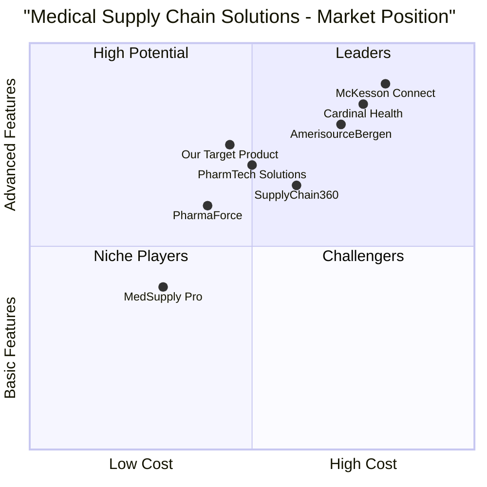

# Medical Supply Chain Website - Product Requirements Document (PRD)

## 1. Language & Project Information

**Language:** English  
**Programming Language:** React.js, TypeScript, Tailwind CSS  
**Project Name:** medical_supply_chain_website  
**Original Requirements:** Create a comprehensive web-based medical supply chain management system with role-based authentication supporting Pharmacies, distributors, Admins, and Customers. The system includes pharmacy portal with statistics and inventory management, distributor portal with order management, admin control panel with tracking capabilities, and customer website with medicine search and ordering functionality.

## 2. Product Definition

### 2.1 Product Goals

1. **Streamline Medical Supply Chain Operations**: Create an integrated platform that connects pharmacies, distributors, and customers to optimize medicine procurement, inventory management, and distribution processes.

2. **Enhance Operational Efficiency Through AI**: Implement AI-powered demand forecasting and automated invoice processing to reduce manual work, minimize stockouts, and improve supply chain accuracy.

3. **Improve Customer Access and Experience**: Provide customers with easy medicine search, availability checking, and convenient ordering options while ensuring reliable supply chain transparency.

### 2.2 User Stories

**As a Pharmacy Manager**, I want to view real-time statistics and manage inventory so that I can make informed decisions about stock levels and procurement needs.

**As a distributor**, I want to receive and process pharmacy orders through a centralized dashboard so that I can efficiently fulfill orders and update delivery status.

**As a System Administrator**, I want to monitor all supply chain operations and track shipments in real-time so that I can quickly identify and resolve any issues or delays.

**As a Customer**, I want to search for medicines and check availability at nearby pharmacies so that I can place orders and choose convenient pickup options.

**As a Pharmacy Owner**, I want automated reorder suggestions based on sales data so that I can maintain optimal stock levels without manual monitoring.

### 2.3 Competitive Analysis

| Product | Pros | Cons |
|---------|------|------|
| **McKesson Connect** | Established market leader, comprehensive supply chain solutions, strong distributor network | High cost, complex implementation, limited customization |
| **Cardinal Health** | Robust inventory management, good analytics, reliable distribution | Expensive licensing, steep learning curve, limited AI integration |
| **AmerisourceBergen** | Strong pharmaceutical focus, good compliance features, established relationships | Limited technology innovation, high operational costs |
| **PharmaForce** | Modern interface, good mobile support, competitive pricing | Limited market presence, fewer integrations, smaller distributor network |
| **MedSupply Pro** | Cost-effective, easy implementation, good customer support | Limited scalability, basic analytics, fewer advanced features |
| **PharmTech Solutions** | Strong AI features, good automation, modern architecture | New market entrant, limited proven track record |
| **SupplyChain360** | Comprehensive tracking, good reporting, multi-industry support | Not healthcare-specific, complex configuration, high maintenance |

### 2.4 Competitive Quadrant Chart

## 3. Technical Specifications

### 3.1 Requirements Analysis

The Medical Supply Chain Website requires a comprehensive web-based platform that supports multiple user roles with distinct functionalities. The system must provide secure, role-based authentication for Pharmacies, distributors, Admins, and Customers, with each role having dedicated login pages and dashboards.

Key technical requirements include:

- **Multi-tenant Architecture**: Support for different user roles with role-specific dashboards and permissions
- **Real-time Data Processing**: Real-time order and delivery status updates integrated into dashboards and customer interfaces
- **AI Integration**: AI demand forecasting for automatic reorder triggers and AI-powered invoice processing for distributor stock updates
- **Scalable Database Design**: Distributed MongoDB architecture with dedicated databases for inventory, distributors, and orders ensuring modularity and fault isolation
- **Responsive Web Design**: React.js frontend for responsive dashboards and user interfaces with Node.js GraphQL APIs for data communication

### 3.2 Requirements Pool

#### P0 (Must-Have) Requirements

1. **User Authentication System**
   - Multi-role login system (Pharmacy, distributor, Admin, Customer)
   - Secure session management and role-based access control
   - Password reset and account management functionality

2. **Pharmacy Portal Core Features**
   - Statistics dashboard with visual charts showing income, total medicines, sales trends, and performance indicators
   - Inventory management interface for stock updates, search, and tracking including expiry dates and batch numbers
   - Basic order management and procurement interface

3. **distributor Portal Essential Features**
   - Order management interface to view pharmacy orders, confirm dispatch, and generate shipping updates
   - Basic inventory management for distributor stock
   - Order fulfillment tracking and status updates

4. **Admin Control Panel**
   - Order tracking dashboard displaying pharmacy orders, distributor fulfillment status, and delivery progress
   - User management and system configuration
   - Basic reporting and analytics

5. **Customer Interface**
   - Medicine search functionality by name or category with availability checking at nearest pharmacies
   - Online order placement with automatic bill generation
   - Pharmacy pickup options

#### P1 (Should-Have) Requirements

1. **Advanced AI Features**
   - AI demand forecasting model for automatic reorder triggers based on past sales data and low-stock thresholds
   - AI-powered invoice reader for automated stock updates from distributor invoices

2. **Inter-Clinic Network (ICN)**
   - Web-based exchange platform for pharmacies to post excess stock or request medicines from nearby pharmacies to reduce wastage

3. **Advanced Tracking**
   - Hub-wise logistics tracking with map-based real-time shipment tracking using geo-sensor data
   - Real-time notifications and alerts system

4. **Error Management**
   - Error and exception handling tools for resolving shipment errors, mismatched stock, or delivery delays

#### P2 (Nice-to-Have) Requirements

1. **Kiosk Integration**
   - Integration with pharmacy kiosks for customer ordering, with fallback to manual purchase

2. **Advanced Analytics**
   - Predictive analytics for demand planning
   - Advanced reporting and business intelligence dashboards
   - Performance optimization recommendations

3. **Mobile Applications**
   - Native mobile apps for iOS and Android
   - Offline functionality for critical operations

### 3.3 UI Design Draft

#### Color Scheme

- **Primary Colors:**
  - Dark Navy Blue (#0A1D37) - Headers, navbar, and backgrounds for professional and trustworthy base
  - Light Blue (#4BA3C3) - Accent color for buttons, links, and highlights for modern and approachable design
  - Medical Green (#3BB273) - Success states, confirmation, and key CTAs representing health, freshness, and reliability

- **Secondary Colors:**
  - Soft White/Off-White (#F9FAFB) - Clean background for dashboards and cards with minimal strain
  - Grey Neutral (#6B7280) - Text, borders, and secondary buttons
  - Alert Red (#E63946) - Errors, stock-outs, or urgent warnings

#### Layout Structure

**Header/Navigation:**
Dark Navy Blue background with white text, containing:
- Company logo and branding
- Role-specific navigation menu
- User profile and logout options
- Notification indicators

**Dashboard Layout:**
White cards on soft blue background, charts in green/blue, headings in navy
- Grid-based card system for key metrics
- Responsive design for mobile and tablet compatibility
- Sidebar navigation for secondary functions

**Forms and Interactions:**
Primary actions in Medical Green, Secondary actions in Light Blue
- Consistent form styling with validation feedback
- Loading states and progress indicators
- Confirmation dialogs for critical actions

#### User Interface Examples

**Login Page:** Dark navy background, light blue input fields, green login button

**distributor Dashboard:** Navy sidebar, white content area, light blue highlights

**Customer Website:** Light theme with green "Order Now" CTAs and blue search bar

### 3.4 Open Questions

1. **Integration Requirements**: What existing pharmacy management systems need to be integrated with the platform?

2. **Compliance and Regulations**: What specific healthcare and pharmaceutical regulations must be addressed (HIPAA, FDA, etc.)?

3. **Scalability Expectations**: What is the expected number of concurrent users and transaction volume?

4. **Data Migration**: How will existing pharmacy and distributor data be migrated to the new system?

5. **Third-party Integrations**: Are there specific payment gateways, shipping providers, or pharmaceutical databases that need integration?

6. **Backup and Disaster Recovery**: What are the requirements for data backup, system redundancy, and disaster recovery procedures?

7. **Performance Requirements**: What are the acceptable response times and uptime requirements for different system components?

8. **Security Standards**: What specific security certifications or standards must the system comply with?

9. **Notification Preferences**: How should users receive notifications (email, SMS, in-app) and what are the customization options?

10. **Reporting Requirements**: What specific reports and analytics are needed for regulatory compliance and business operations?

## 4. Implementation Roadmap

### Phase 1: Core Platform (Months 1-3)
- User authentication and role management
- Basic pharmacy and distributor portals
- Core inventory management features
- Customer medicine search and ordering

### Phase 2: Advanced Features (Months 4-6)
- AI integration for demand forecasting
- Advanced tracking and logistics
- Inter-Clinic Network implementation
- Admin control panel enhancements

### Phase 3: Optimization & Scale (Months 7-9)
- Performance optimization
- Advanced analytics and reporting
- Mobile application development
- Third-party integrations

### Phase 4: Enhancement (Months 10-12)
- Kiosk integration
- Advanced AI features
- Additional compliance features
- System optimization and scaling

## 5. Success Metrics

- **User Adoption**: 80% of target pharmacies and distributors onboarded within 6 months
- **Order Processing Efficiency**: 50% reduction in order processing time
- **Inventory Accuracy**: 95% inventory accuracy across all pharmacies
- **Customer Satisfaction**: 4.5+ star rating on customer experience
- **System Uptime**: 99.9% system availability
- **Cost Reduction**: 30% reduction in supply chain operational costs